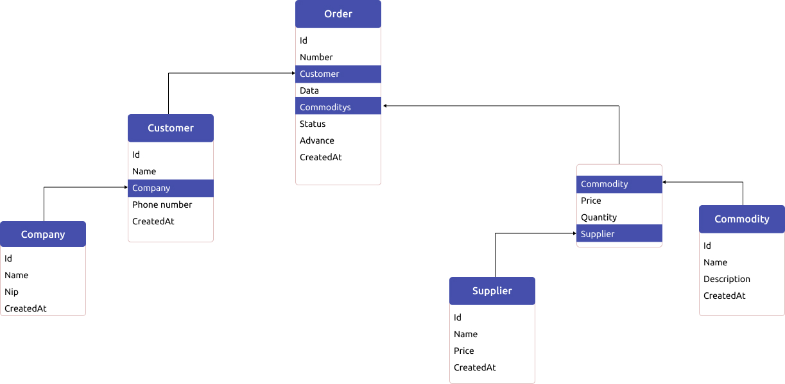

# Web order application

## Description

This app help manage a orders from customers.
Stores information about customers, suppliers, commodities and companies.
More about functionality in backend section.

**[Figma preview link](https://www.figma.com/file/7ZKnX3NJ3gYRNp0QeSE1vd/Order-App?node-id=0%3A1)**

# Backend
---

  

The backend is made in use NestJs framework.
It has:

- User authorisation using JWT
- Commodity entitry
- Company entitry
- Customer entitry
- Supplier entitry
- Order entitry

#### Authorisation

- [x] Login user PATH: **/auth/login**
- [x] Register user  PATH: **/auth/register**
- [ ] Get user  PATH: **/auth/me**  :shield:

#### Commodity :shield:

- [x] Gets all commodities Get: **/commodity**
- [x] Get commodity by id  Get: **/commodity/:id**
- [x] Add new commodity  Post: **/commodity/add**
- [x] Update commodity by id  Put: **/commodity/update/:id**
- [x] Delete commodity by id  Delete: **/commodity/delete/:id**

#### Company :shield:

- [x] Gets all companies Get: **/company**
- [x] Get company by id  Get: **/company/:id**
- [x] Add new company  Post: **/company/add**
- [x] Update company by id  Put: **/company/update/:id**
- [x] Delete company by id  Delete: **/company/delete/:id**

#### Customer :shield:

- [x] Gets all customiers Get: **/customer**
- [x] Get customer by id  Get: **/customer/:id**
- [x] Add new customer  Post: **/customer/add**
- [x] Update customer by id  Put: **/customer/update/:id**
- [x] Delete customer by id  Delete: **/customer/delete/:id**

#### Supplier :shield:

- [x] Gets all syppliers Get: **/supplier**
- [x] Get supplier by id  Get: **/supplier/:id**
- [x] Add new supplier  Post: **/supplier/add**
- [x] Update supplier by id  Put: **/supplier/update/:id**
- [x] Delete supplier by id  Delete: **/supplier/delete/:id**

#### Order :shield:

- [x] Gets all orders Get: **/order**
- [x] Get order by id Get: **/order/:id**
- [x] Gets last x order Get: **/order/last/:range**
- [x] Gets customers list with the most orders   Get: **/order/best/customers**
- [x] Gets the most ordered commodities  Get: **/order/best/commodities**
- [x] Gets orders list for specifice type and item. Example: /order/commodity/1  Get: **/order/:type/:id**
- [x] Add new order  Put: **/order/add**
- [ ] Update supplier by id  Put: **/order/update/:id**
- [ ] Delete supplier by id  Delete: **/order/delete/:id**

## Correlations

# Client
---

  

Client site app use a Vue framework with Typescript.
To style i use preprocesor Sass and Vuex to manage a states 

## View pages

- [x] **Login pages**
- [x] **Register pages**
- [ ] **Dashboard open section**
  - [ ] Chart
  - [x] Best customers
  - [x] Best ordered commodities
  - [x] Last added orders
- [x] **Customers list**
- [x] **Customer detail**
  - [x] Customer information
  - [x] The company to which the customer belong
  - [x] The customer last orders
- [ ] **Add new customer form**
- [x] **Companies list**
- [x] **Company detail**
  - [x] Comapny information
  - [x] Employees belong to the company
  - [x] The company last orders
- [ ] **Add new company form**
- [x] **Suppliers list**
- [x] **Supplier detail**
  - [x] Supplier information
  - [x] The most ordered commodities
  - [x] The supplier last orders
- [ ] **Add new supplier form**
- [x] **Commodities list**
- [x] **Commodity detail**
  - [x] Commodity information
  - [x] Suppliers list
  - [x] The Commodity last orders
- [ ] **Add new commodity form**
- [x] **Orders list**
- [x] **Order detail**
  - [x] List of commodities
  - [x] Order info
  - [x] Customer info
  - [x] Supplier info
- [ ] **Add new order form**
